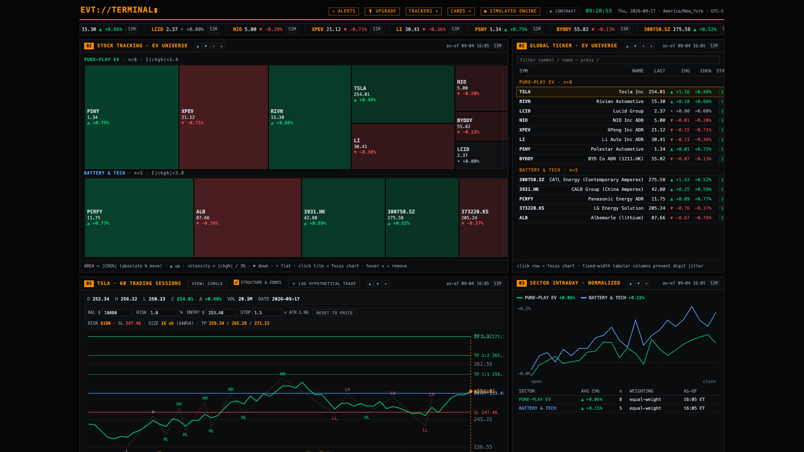
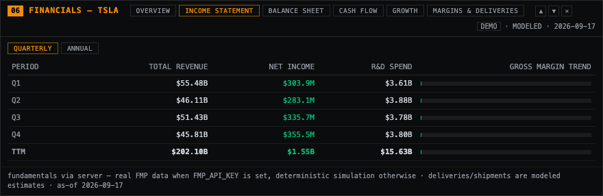

# EVT://TERMINAL

[](https://opensource.org/licenses/MIT)
[](https://github.com/Sami-Gor/ev-terminal/releases)
[](https://nodejs.org/)



A Bloomberg-style monitoring terminal for **pure-play EV OEMs and battery manufacturers** — Tesla, Rivian, Lucid, NIO, XPeng, Li Auto, Polestar, BYD, CATL, CALB, Panasonic Energy, LG Energy Solution and Albemarle — with live WebSocket pricing, a frame-buffered render loop, multi-timeframe charts, market-structure overlays, a position-sizing calculator, a paper-trade journal, commodity correlations and price alerts.

> **Disclaimer:** this project is a monitoring/analysis tool, not investment advice. Without API keys it runs on a deterministic *simulated* feed; with keys it displays real market data. Nothing here is a recommendation.

---



## Features

| Feature | What you get |
|---|---|
| **Live data engine** | WebSocket tick fan-out with auto-reconnect and frame-buffered rendering; REST history/quotes via Polygon.io or FinancialModelingPrep — or a deterministic simulated feed when no keys are set |
| **Focus chart** | Single and multi-timeframe (D / 4H / 15M) views, ZigZag swing labels (HH/HL/LH/LL), fresh supply/demand zones, draggable Entry/Stop/TP lines with live position sizing (ATR-14 based) |
| **Analytics cards** | Fundamentals (TTM KPIs, income statement, margins & deliveries), trade journal with backtest metrics (win rate, profit factor, expectancy, equity curve), EV-vs-commodity correlation matrix (30-session returns-based Pearson) |
| **Market overview** | Global ticker tape and table, sector heatmap, sector intraday lines, battery-metals monitor, global session clock |
| **Alerts** | Price crossings and daily-% change triggers with toast notifications, optional audio chime and a persisted history tray |
| **Accessibility** | WCAG 2.1 AA oriented — high-contrast colorblind-safe palette (teal/vermillion) toggle, `aria-live` status regions, full keyboard operation (`Tab`, `Enter`, arrows, `Escape`, `/` to search), focus-visible rings |

## Quick Start

> **Requirement:** Node.js **>= 18.0.0** (npm ships with Node).

```bash
git clone <your-fork-url> ev-terminal
cd ev-terminal
npm install
npm start
# open http://localhost:3000
```

No API keys are required to try it: without keys the backend runs a deterministic **simulated feed** (the UI labels it `LIVE · SERVER SIM`).

## API Key Configuration

Copy the template and add your keys:

```bash
cp .env.example .env
```

| Variable | Default | Description |
|---|---|---|
| `POLYGON_API_KEY` | *(empty)* | Polygon.io REST key. Enables real daily aggregates, intraday 4H/15M bars and snapshot quotes. |
| `FMP_API_KEY` | *(empty)* | FinancialModelingPrep key. Enables real daily history, batch quotes and fundamentals (key-metrics-TTM, income statements). |
| `PORT` | `3000` | HTTP + WebSocket listen port. |
| `ALLOWED_ORIGINS` | localhost variants | Comma-separated origins allowed to call the API and open the WebSocket feed. |

Provider priority: **Polygon → FMP → simulated**. Keys are read only by `src/backend/config`; they are never sent to the browser or written to logs.

## Data sources & distribution mode

**The distributed app ships on a deterministic simulated engine — that is the v1.0 product.** Real-time and delayed market data are a *planned paid upgrade*: market-data vendors (Polygon, FMP) prohibit distributing an application built on individual-tier keys, so live data unlocks only after a business-tier data agreement.

| `DISTRIBUTION_MODE` | Behavior |
|---|---|
| `local` (default) | Developer's own single-user run. Personal Polygon/FMP keys via `.env` work (provider priority: Polygon → FMP → simulated). Not for distribution. |
| `public` | Shipped build: locked to the simulated engine. Vendor keys in the environment are ignored, no key-entry surface is exposed, and `/api/status` honestly reports `mode: "simulated"`. |

The UI reflects this: simulated runs badge **`● SIMULATED ENGINE`** (amber, never a green "LIVE"), and a header **⬆ UPGRADE** hook captures email interest for the future paid tier (stored server-side in a git-ignored file, never committed). A **BROKER ↗** popover carries a static outbound referral link to Trade Nation with a risk-disclosure placeholder (`{{TRADE_NATION_RISK_DISCLOSURE}}`) — no OAuth, no order routing, no account linking.

## The `android/` directory and `ANDROID_PERFORMANCE_AUDIT.md`

`android/` is a **native Kotlin companion client** (not a WebView wrapper): an OkHttp WebSocket client + ViewModel consume the same Node feed, and a Jetpack Compose dashboard renders tickers, an EV-fleet telemetry HUD and the news wire. It shares the backend's protocol (subscribe payload, tick schema) and licensing posture. `ANDROID_PERFORMANCE_AUDIT.md` documents that module's performance, state-hygiene and recomposition audit — lazy-list keys, flow conflation, process-lifecycle socket gating — and the fixes applied against it.

## Architecture

```
public/index.html            markup only (no inline CSS/JS)
src/frontend/
  main.js                    boot orchestrator (deterministic init order)
  components/                15 panels/widgets: focus-chart · heatmap · ticker-table · tape ·
                             sector · news · metals · clock · index-map-free layout ·
                             financials · journal · correlation · alerts · trackers ·
                             layout-manager · connection-indicator
  services/                  store (state + bus) · api (REST) · ws-client (feed) ·
                             render-scheduler (rAF tick buffer)
  utils/                     format · indicators (ATR/zigzag/pearson/zones) · sanitize ·
                             theme (colorblind palette) · demo-engine (offline fallback)
  styles/                    theme · grid · panels · analytics
src/backend/
  config/index.js            environment & constants
  providers/                 demo (simulated feed) · polygon · fmp · financials
  routes/                    status · history · quote · financials
  services/                  market-data (caching/orchestration) · ttl-cache · symbol-utils
  websocket/feed-manager.js  origin gate, per-client subscriptions, heartbeat, poller
app + entry                  src/backend/app.js (Express assembly) · server.js (entry)
```

*45 files total: 25 frontend JS modules, 14 backend JS modules, 4 stylesheets, plus `server.js` and `public/index.html`.*

Data flow: `provider → market-data service (TTL cache) → REST/WS → store → render-scheduler (rAF) → in-place DOM patches`. Chart redraws are throttled full renders only when price escapes the rendered range; everything else patches in place.

### REST API

| Endpoint | Description |
|---|---|
| `GET /api/status` | provider mode, WS client count, subscriptions |
| `GET /api/history/:symbol?timeframe=d\|4h\|15m` | 60 bars of OHLCV |
| `GET /api/quote/:symbol` | price, change, %change, volume, profile |
| `GET /api/financials/:symbol` | TTM metrics, statements, modeled deliveries |

### Keyboard

| Key | Action |
|---|---|
| `/` | focus the ticker search filter |
| `←` / `→` | move the chart crosshair |
| `Enter` | pin the chart inspector / activate focused row or tile |
| `↑` / `↓` | navigate ticker rows |
| `Escape` | close popovers / unpin the inspector |

## Security

Hardened by default: Helmet headers with CSP, origin-restricted CORS and WebSocket upgrades, 100 req/15 min API rate limiting per IP, 4 KB WS message cap, 50-symbol per-socket subscription cap, ping/pong heartbeat, sanitized error responses and XSS-escaped rendering. See [SECURITY.md](SECURITY.md) for disclosure policy and [CONTRIBUTING.md](CONTRIBUTING.md) for the pre-commit secret scanner.

## License

[MIT](LICENSE). Third-party packages and their licenses are listed in [THIRD_PARTY_NOTICES.md](THIRD_PARTY_NOTICES.md).
# EVT://TERMINAL
